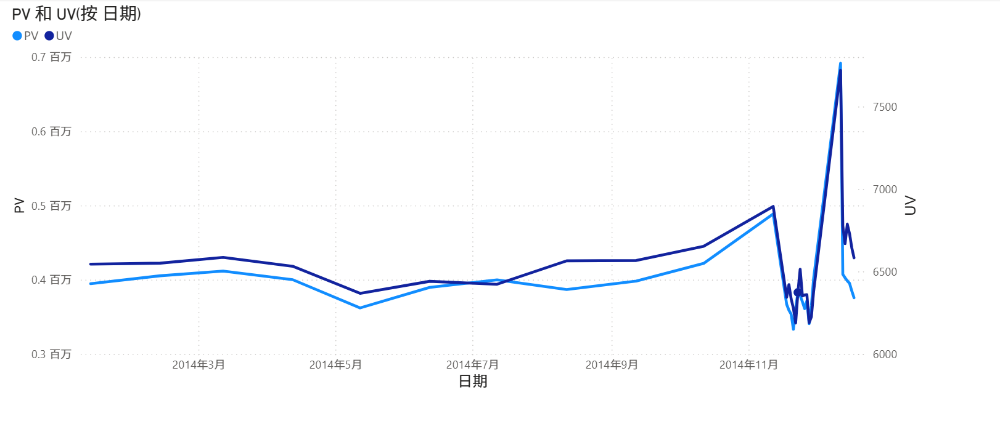
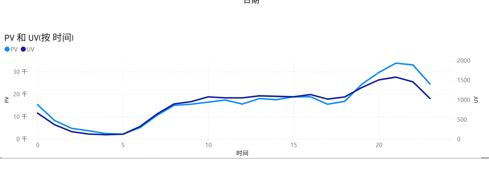
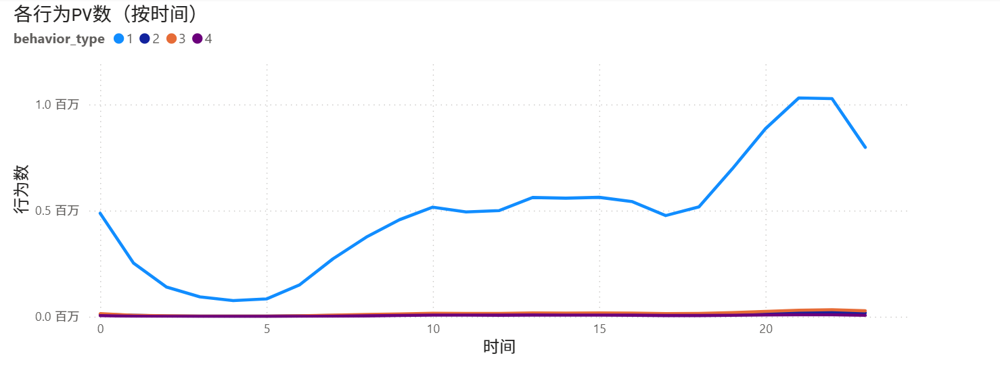
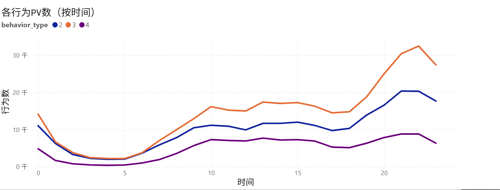
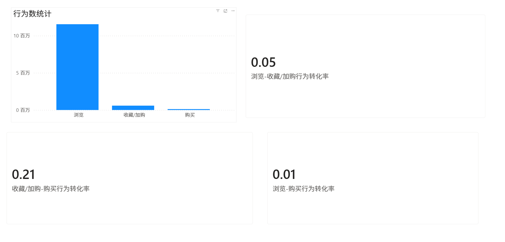
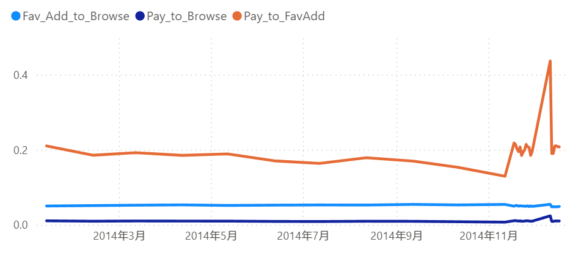
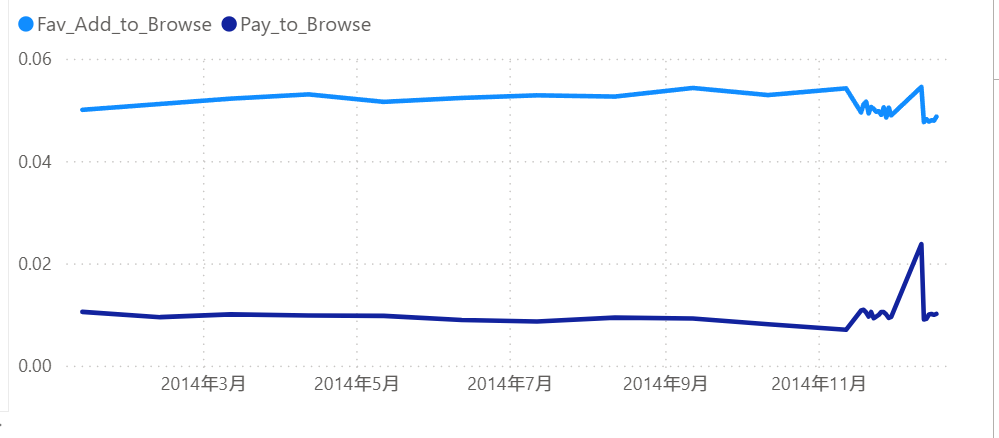
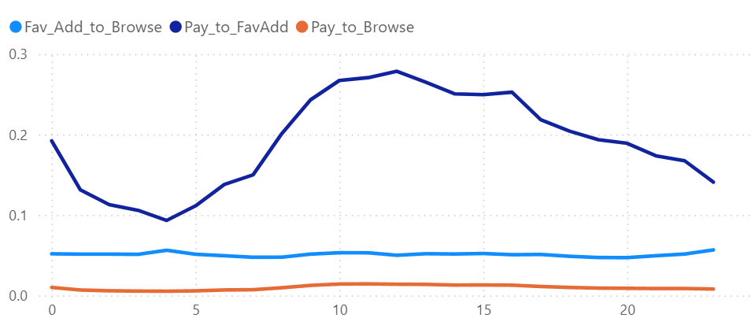
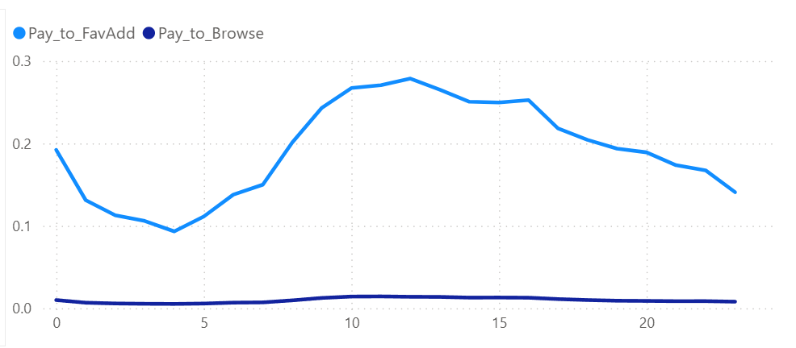
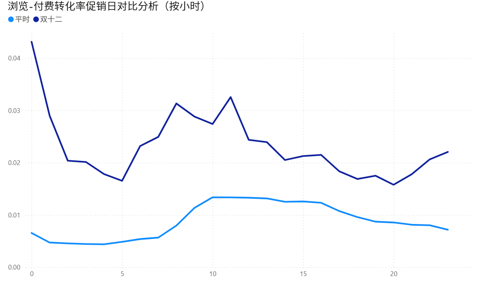

# 淘宝用户购买行为分析

## 项目简介
本项目基于淘宝移动端用户行为数据，分析用户 PV（页面访问量）和 UV（独立用户数）在不同日期和小时的变化趋势，挖掘用户活跃规律，为运营活动和营销策略提供参考。

## 数据概览
- train_user_sample.csv：用户行为日志（user_id, item_id, behavior_type, item_category, date, hour）  
- train_item_sample.csv：商品信息（item_id, item_category）  
- 字段说明：
  | 字段 | 含义 |
  |------|------|
  | user_id | 用户标识 |
  | item_id | 商品标识 |
  | behavior_type | 用户行为类型（1=浏览, 2=收藏, 3=加购, 4=购买） |
  | item_category | 商品分类 |
  | date | 日期（YYYY-MM-DD） |
  | hour | 小时（0-23） |

## 数据清洗

- 检查空值和异常值
- user 表 time 拆分为 date + hour
- item 表 item_category 按 item_id 对应到 train_user

SQL 示例：

```sql
-- 检查异常值
SELECT behavior_type AS b
FROM train_user
WHERE behavior_type NOT IN (1,2,3,4) OR behavior_type IS NULL;

-- 添加 date 和 hour
ALTER TABLE train_user
ADD COLUMN date DATE,
ADD COLUMN hour TINYINT;

UPDATE train_user
SET date = STR_TO_DATE(time, '%Y-%m-%d %H'),
    hour = CAST(SUBSTRING_INDEX(time, ' ', -1) AS UNSIGNED);

-- 合并商品分类
UPDATE train_user u
LEFT JOIN train_item i
ON u.item_id = i.item_id
SET u.item_category = i.item_category;
``` 

## 数据分析 & 可视化
## Part1. 流量分析
我们先从宏观的流量分析入手，看看用户访问行为的规律。主要关注以下指标：

- **PV（Page View）**：页面访问量，基于用户每次刷新或打开页面统计
- **UV（Unique Visitor）**：独立访客，一个用户多次访问只计一次

**1. 日级访问趋势**  
- 指标：PV, UV  
- 方法：将 train_user 按 date 聚合 PV / UV  
- 图表：  
  
- **分析结论**：
  - 整体来看，PV 与 UV 的变化趋势基本一致，说明访问量的变化主要由活跃用户规模变化驱动，而不是单纯由少数用户重复访问造成。
  - 11 月前后 PV 和 UV 出现明显下降，可能与阶段性活动缺失、用户消费节奏变化或节假日因素有关，后续可以结合活动日历进一步验证。
  - 12 月 PV 和 UV 出现明显增长，说明该阶段用户访问活跃度显著提升，可能与年末促销、双十二活动或集中营销投放有关。
  - 从业务角度看，平台可以在 12 月前提前进行活动预热、商品曝光和库存准备，同时针对 11 月活跃度下降阶段设计促活活动，避免用户活跃流失。


**2. 小时级访问趋势**  
- 指标：PV, UV  
- 方法：将 train_user 按 hour 聚合 PV / UV  
- 图表：  
  
- **分析结论**：
  - 凌晨 2 点到 5 点 PV 和 UV 均处于低位，说明该时间段用户活跃度最低，可以作为系统维护、数据同步或批处理任务的优先时间窗口。
  - 早上 6 点后用户活跃度逐渐回升，白天整体较为平稳，说明用户在工作日或日常时间段存在持续浏览行为。
  - 17 点之后 PV 和 UV 明显上升，并在 20 点到 22 点附近达到高峰，说明晚间是用户集中访问和购物决策的重要时段。
  - 从运营角度看，平台可以将优惠券推送、限时活动、直播推荐和重点商品曝光集中安排在 20 点到 22 点，以提高活动触达和转化效率。
 

**3. 不同用户行为小时级访问趋势**
- 指标：PV, UV  
- 方法：将 train_user 按 hour 聚合 PV / UV
- 图表：
- 
- 因为behavior_type为1（浏览行为）的占比非常大，导致上图其它几类behavior的趋势不太明显，我们去掉behavior_type为1的数据后再来看看：
- 
- **分析结论**：
  - 从完整图可以看出，行为 1（浏览）在所有行为中占绝对主导地位，说明用户在平台上的主要行为仍然是浏览商品，真正进入收藏、加购和购买环节的用户比例相对较低。
  - 行为 2、3、4 单独展示后可以发现，收藏、加购和购买行为均呈现明显的晚间高峰，尤其在 20 点到 22 点附近达到较高水平，说明晚间不仅是用户浏览高峰，也是用户产生购买意向和完成购买的重要时段。
  - 行为 3（加购）整体高于行为 2（收藏）和行为 4（购买），说明用户对商品存在较强购买意向，但仍有一部分加购行为没有立即转化为购买。
  - 行为 4（购买）整体数量最低，但变化趋势与加购行为较为接近，说明加购行为与购买行为之间存在一定关联，后续可以进一步分析“加购 → 购买”的转化率。
  - 凌晨 2 点到 5 点期间，各类行为数量均处于低位，说明该时间段用户活跃度较低。


#### 流量分析总体业务建议

基于以上发现，可以提出以下业务建议：

1. **将 20 点到 22 点作为重点运营时段。**  
   在该时段集中安排优惠券推送、限时秒杀、直播推荐、重点商品曝光等活动，提高用户触达效率和购买转化率。

2. **围绕年末高峰提前进行活动预热。**  
   12 月访问量明显增长，平台可以在高峰到来前进行活动预热、商品推荐、库存准备和广告投放，以承接用户集中访问带来的转化机会。

3. **重点运营加购未购买用户。**  
   对已经加购但未购买的用户，可以通过购物车提醒、库存提醒、降价通知、限时优惠券等方式进行召回，提高加购到购买的转化率。

4. **优化浏览到深层行为的转化链路。**  
   由于浏览行为远高于收藏、加购和购买，说明用户在浏览后存在较大流失。后续可从商品详情页、价格展示、评价内容、推荐准确度和促销力度等方面优化，提升用户进一步互动和购买的意愿。

5. **将低活跃时段用于系统维护和后台任务。**  
   凌晨 2 点到 5 点用户活跃度较低，可以安排系统维护、数据同步、报表刷新等后台任务，减少对用户体验的影响。


 
 ## Part2. 转化率分析

### 1. 指标体系

本项目转化率分析使用以下核心指标：

| 指标名称 | 计算方式 | 业务含义 |
|----------|----------|----------|
| PV | COUNT(train_user[behavior_type]=1) | 浏览行为次数，用于衡量用户访问量 |
| UV | DISTINCTCOUNT(train_user[user_id]) | 独立用户数，用于衡量覆盖人数 |
| Fav_Add_to_Browse | (收藏+加购)/浏览(PV) | 浏览→收藏/加购的转化率，反映用户兴趣触发率 |
| Pay_to_Browse | 购买次数/浏览(PV) | 浏览→购买的总体转化率，反映整体漏斗效率 |
| Pay_to_FavAdd | 购买次数/(收藏+加购) | 收藏/加购→购买的转化率，反映有兴趣用户的最终转化效率 |

> 行为类型说明：
> - 1 = 浏览  
> - 2 = 收藏  
> - 3 = 加购  
> - 4 = 购买

---

### 2. 整体漏斗概览（柱状图）

- **图表**：柱状图  
- **X轴**：转化环节（浏览、收藏/加购、购买）  
- **Y轴**：数量（PV）  
- **标注**：显示各环节转化率  

**观察与结论**：  

- 浏览到收藏/加购转化率约 5%，说明大部分用户只是浏览商品。  
- 收藏/加购到购买转化率约 20%，说明有兴趣的商品更容易转化为购买。  
- 浏览到购买整体转化率约 1%，说明整体漏斗存在较大流失。

**示意图**：  


**业务启示**：

- 优化浏览到加购/收藏环节，提升用户兴趣转化。  
- 对加购/收藏用户加强引导或营销，可提升最终购买率。

---

### 3. 平时转化率趋势分析（折线图）

- **图表**：折线图  
- **X轴**：小时或日期  
- **Y轴**：转化率（Fav_Add_to_Browse、Pay_to_Browse、Pay_to_FavAdd）  
- **图例**：三种转化率指标  

**观察与结论**：  

- 平时收藏/加购 → 购买转化率波动较小，略高于浏览 → 购买转化率。  
- 转化率在平时一天中呈小幅波动，高峰可能出现在晚间，但幅度有限。  
- 这一图主要用于理解平时用户转化行为规律，为活动日对比提供背景。

**示意图**：  





**业务启示**：  

- 平时转化率稳定，说明日常运营规律可预测。  
- 可以重点优化加购/收藏环节，提升浏览 → 加购的转化。

---

### 4. 双十二/活动日对比分析（折线图）

- **图表**：折线图 + 日期筛选器  
- **X轴**：小时  
- **Y轴**：转化率  
- **图例**：平时 vs 双十二  

**观察与结论**：  

- 双十二当天整体转化率明显高于平时。  
- **深夜 22–23 点达到峰值**，收藏/加购 → 购买转化率大幅提升，说明促销活动极大刺激了深夜购买行为。  
- 浏览 → 收藏/加购和浏览 → 购买转化率也有所上升，但峰值不如收藏/加购 → 购买显著。  

**示意图**：  


**业务启示**：  

- 深夜是双十二用户转化高峰，可安排限时促销、库存提醒或推送活动。  
- 对仓储、客服和系统资源进行深夜优化，保证活动顺利进行。  
- 关注加购/收藏环节，通过深夜激励提高最终购买转化率。

---

### 2.4 总结

1. 整体漏斗显示浏览到购买流失大，但收藏/加购 → 购买转化率高。  
2. 平时折线图提供时间分布规律，活动日对比显示双十二深夜是转化率峰值。  
3. 双十二分析显示大促活动显著提升转化率，尤其对有兴趣的用户（加购/收藏）刺激明显。  
4. 业务建议：  
   - 深夜活动策略优化  
   - 加购环节优化，提高浏览 → 加购转化  
   - 系统与物流资源调度确保高峰顺畅
